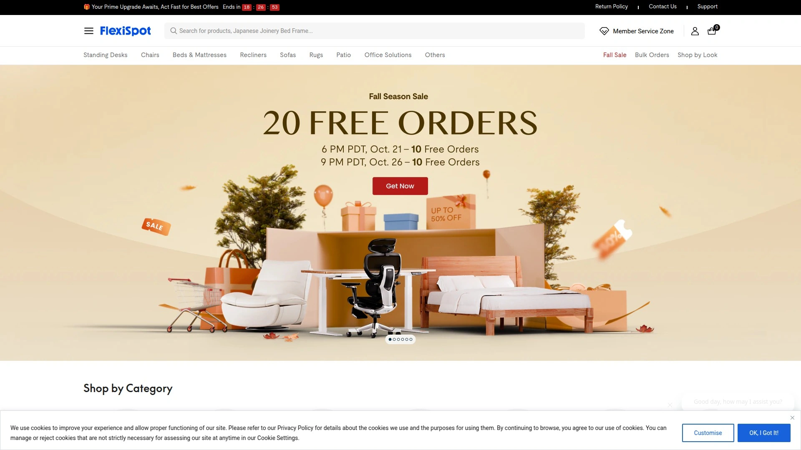
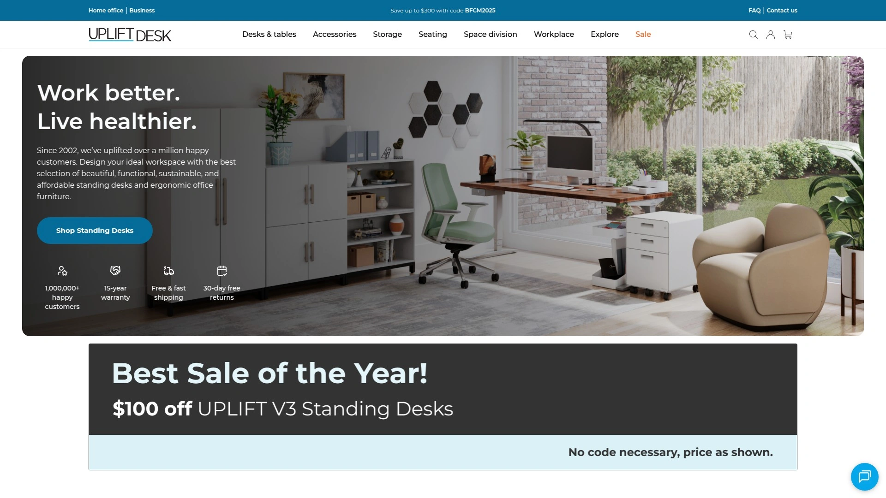
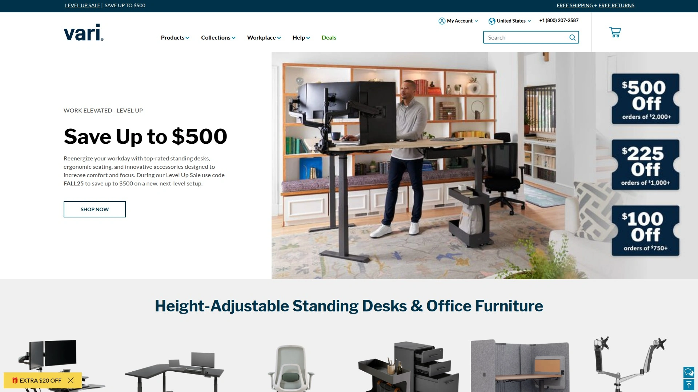
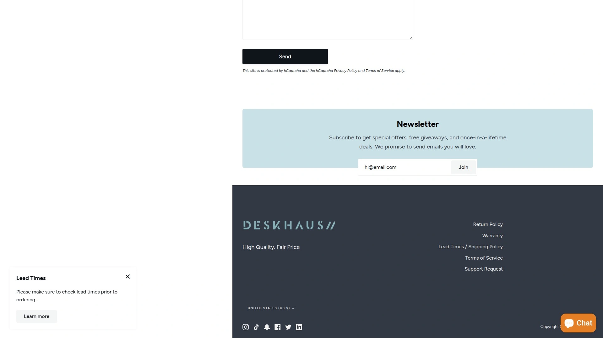
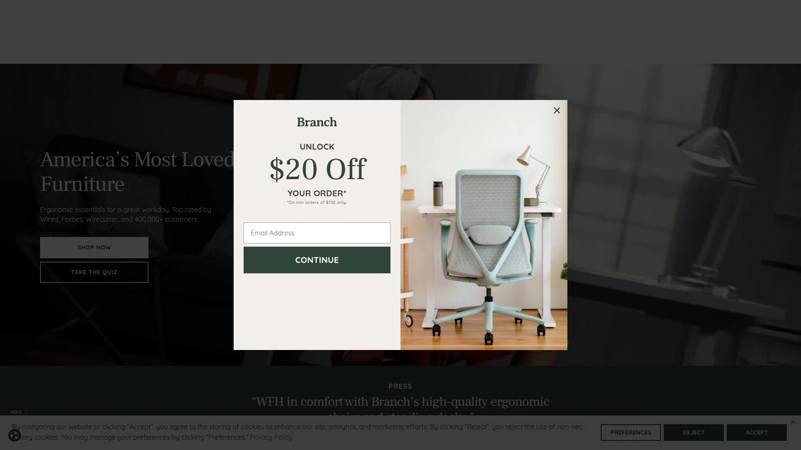
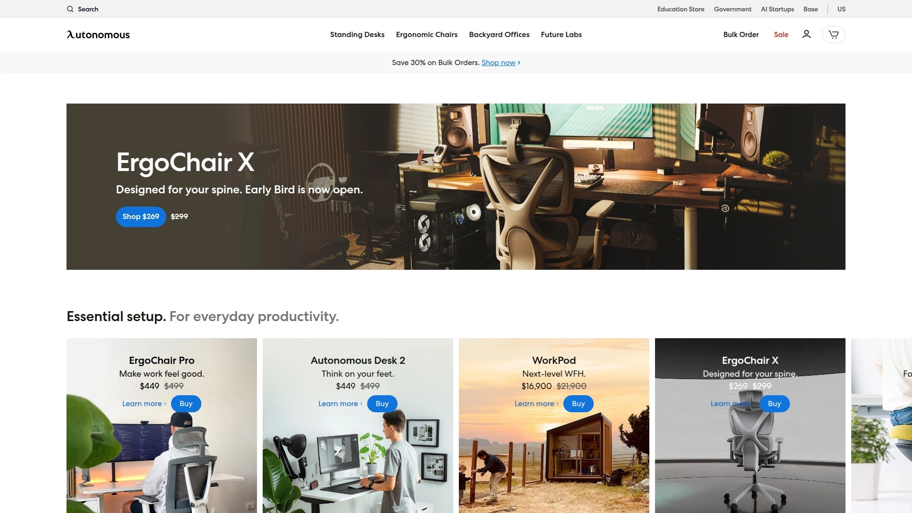
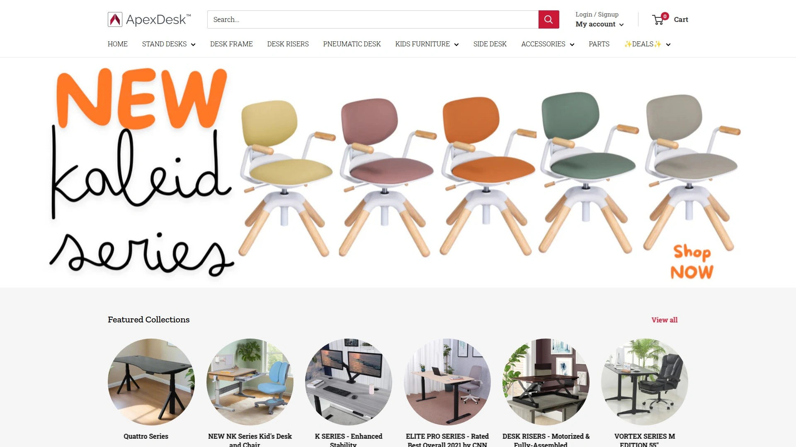
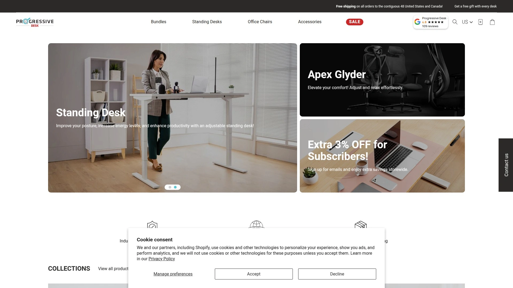
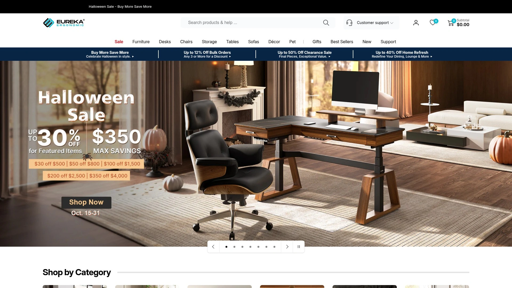
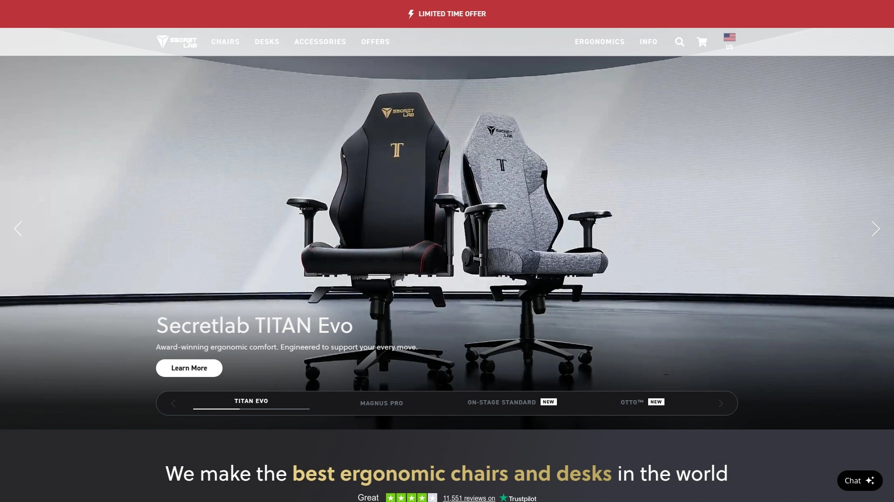

# Top 12 Best Ergonomic Standing Desks in 2025 (Latest Updated)

FlexiSpot, Uplift, Vari, and DeskHaus—you've probably seen these names floating around when hunting for a standing desk. But here's the thing: not all standing desks are built the same. Some wobble like a newborn giraffe when you're typing. Others can't handle more than a laptop without groaning. And then there's the price tag confusion—why does one desk cost three hundred bucks while another demands two grand?

If you've been glued to your chair for eight hours a day, your back's probably staging a quiet rebellion. Your shoulders are doing that thing where they creep up to your ears. Your wrists feel like they've been through a medieval torture device. A standing desk won't magically fix everything, but it's a solid first step toward not feeling like a question mark by five o'clock.

This roundup covers twelve standing desks that actually hold up under real-world use—stable frames, smooth height adjustments, enough space for your gear, and builds that won't fall apart after six months. We're talking dual motors, programmable height presets, cable management that doesn't look like a nest of angry snakes, and weight capacities that can handle more than a single monitor and a coffee mug.

***

## **[FlexiSpot](https://www.flexispot.com)**

The go-to choice for anyone wanting serious stability without emptying their wallet, perfect for home offices and professionals who spend long hours at their desks.

FlexiSpot's E7 series sits at the top of the standing desk food chain for good reason. The dual-motor system runs smooth and quiet—no grinding noises when you're adjusting height mid-Zoom call. The three-stage lifting columns give you a height range from around 23 inches to 49 inches, which works whether you're five-foot-nothing or pushing six-foot-five. Weight capacity hits 355 pounds on the standard two-leg models, so you can load up multiple monitors, a desktop tower, and whatever else without worrying about structural integrity.

The E7 Plus adds four legs instead of two, which makes a massive difference if you're the type who leans on your desk or types like you're mad at your keyboard. Front-to-back stability on the four-leg version is noticeably better than most competitors. The anti-collision system actually works—desk stops moving if it hits something on the way up or down, instead of just plowing through your desk lamp.

FlexiSpot's control panels range from basic up-down buttons to premium versions with programmable presets, sit-stand reminders, and USB charging ports. The wire management is straightforward—hooks under the desk, a cable tray, and grommets in the desktop. Assembly takes about an hour with two people and basic tools. The laminate desktop options won't win design awards, but they're durable and easy to clean. Bamboo tops are available if you want something that looks less like office furniture.

Prices start around $130 for basic models and climb to $700+ for the four-leg versions with premium features. Customer service is decent—replacement parts ship quickly if something breaks. The warranty covers five years on frames and motors, which is standard for this price range. If you need a desk that handles heavy loads, stays stable at full height, and doesn't cost as much as a used car, FlexiSpot delivers.

***

## **[Uplift Desk](https://www.upliftdesk.com)**

Highly customizable with extensive desktop options and solid stability, ideal for users who want to build their perfect workstation with lots of add-ons.

Uplift's V2 desk dominates the "lots of choices" category. You can pick from over thirty desktop sizes, multiple wood species, laminate finishes, shapes (rectangular, contoured, curved), and edge profiles. Frame colors include black, white, gray, and custom powder coating if you're feeling fancy. The base model starts at a sitting height of 25.5 inches and maxes out at 51.1 inches—plenty of range for most people.

The dual-motor system lifts 355 pounds at a steady pace—about 1.5 inches per second. That's not blazing fast, but it's smooth and quiet enough that you won't disrupt meetings. The control panel has four programmable presets, which is handy if multiple people share the desk or you have specific heights for sitting, standing, and "leaning while thinking" positions. Advanced keypads add features like USB charging and collision detection.

Stability is solid on the V2, though it's not quite at the four-leg desk level. At full height with heavy gear, you'll notice some front-to-back movement if you're typing aggressively. Side-to-side wobble is minimal. The commercial version adds a crossbar for extra stability, which helps if you're over six feet tall and using the desk at its highest setting.

Uplift's accessory ecosystem is massive—monitor arms, CPU holders, keyboard trays, desk pads, cable management kits, desk shelves, power grommets, and more. Most accessories attach without drilling holes in your desktop. The company ships fast, usually next business day. Assembly instructions are clear, takes about 45 minutes with two people. Prices start around $650 for a basic setup and climb past $1,500 if you go crazy with customization.

The warranty covers fifteen years on the full desk, which is longer than most competitors. Customer service is responsive—they'll troubleshoot over phone or email, and replacement parts arrive quickly. If you want a desk that grows with your needs and can be tweaked endlessly, Uplift's the one.

***

## **[Vari](https://www.vari.com)**

Rock-solid build quality with lifetime warranty on key components, perfect for corporate environments and users who prioritize long-term durability.

Vari started as Varidesk, the company that made those clunky desktop converters your office probably had five years ago. They've since evolved into full standing desks that actually work. The Electric Standing Desk line features dual motors, three-stage legs, and a height range from 25 to 50.5 inches. That's one of the widest ranges available, so it handles everyone from short folks to basketball players.

The frame is T-style legs, powder-coated steel, built thick. This desk feels heavy-duty from the moment you unbox it. Weight capacity sits at 200 pounds, which is lower than FlexiSpot or Uplift, but still enough for most setups. The motors are whisper-quiet—you barely hear them move. Four programmable height presets on the control panel, plus anti-collision sensors that actually stop the desk instead of just slowing it down.

Vari's desktop options include laminate finishes in various wood tones, plus a ComfortEdge model with a curved front edge that's easier on your wrists. The 3D laminate is thicker than cheap particle board desks—it resists scratches and water damage better. Assembly is straightforward, all tools included, takes about thirty minutes if you're not completely hopeless with a screwdriver.

The killer feature here is the warranty. Vari backs their electric standing desks with a lifetime warranty on the frame, motors, and mechanical parts. That's rare in this price range. Prices start around $700 and go up to $1,200 depending on size and finish. Free shipping to the continental US, usually arrives in two to five business days.

Vari also offers L-shaped models with three motors—one for each leg section. The L-shape is genuinely massive, perfect for corner setups or if you need tons of surface area for multi-monitor arrays. These models run around $1,500 to $2,000, but they're built like tanks.

***

## **[DeskHaus](https://desk.haus)**

The stability champion with four-leg design and massive weight capacity, best for serious users with heavy setups or anyone who demands zero wobble.

DeskHaus's Apex Pro is what happens when engineers get obsessed with eliminating desk wobble. Four legs, four motors, 600-pound weight capacity. This thing doesn't shake, even at full height with a ridiculous amount of gear piled on top. The legs are double-post design—two vertical columns per corner—which distributes weight better than single-post legs. Front-to-back stability is the best I've seen in any standing desk, period.

Height range runs from 22.5 to 48.5 inches. The quad-motor system adjusts fast—1.5 inches per second—and stays perfectly level because each leg has its own motor. No sync rod needed, no wonky height differences between left and right sides. The control panel is basic but functional—up, down, four memory presets, collision detection via gyroscope system.

DeskHaus sells frames only, so you supply your own desktop or buy one from them. They offer standard laminate tops, solid wood slabs, and custom sizing. Most people go with a local lumber yard or desktop supplier and bolt it to the frame. This keeps costs flexible—you can splurge on a fancy walnut slab or stick with basic plywood depending on budget.

Assembly takes longer than two-leg desks because there are more parts to bolt together. Plan on an hour to ninety minutes. The instructions are digital-only, which is annoying if you're assembling in a room without easy phone access. Once it's together, though, the desk is basically indestructible. DeskHaus frames ship in three business days, which is faster than most custom orders.

Prices start at $799 for the four-leg Apex Pro frame, not including desktop. That's expensive compared to all-in-one desks, but you're paying for commercial-grade stability. The six-leg model exists for L-shaped setups—it's even more stable, if that's possible. Warranty covers the frame and motors, customer service is responsive, and the company has a cult following among people who treat desk stability like a religion.

***

## **[Branch](https://www.branchfurniture.com)**

Sleek Scandinavian design with integrated controls, great for smaller spaces and users who care about aesthetics as much as function.

Branch's Duo Standing Desk looks nothing like typical office furniture. The desktop is plywood with exposed edges, giving it a mid-century modern vibe. The frame is minimalist steel, available in white or carbon black. The standout feature is the integrated control pad—it's built into the corner of the desktop instead of hanging off the edge. This keeps the desk looking clean and prevents accidental height changes when you're reaching for something.

Height range is 25 to 52 inches, which covers most people. Dual motors, three-stage legs, smooth adjustments. Weight capacity is 275 pounds, enough for dual monitors and peripherals without stressing the frame. The desk comes in three sizes—36-inch width for tiny apartments, 48-inch for most home offices, and 60-inch if you need elbow room. The compact size makes it perfect for bedrooms or small dedicated office spaces.

Assembly is simple—thirty minutes, all tools included, clear instructions. The plywood desktop has a downturned front edge that's easier on your wrists than sharp corners. The wood grain is visible and looks good without needing a desk mat to hide ugly laminate. Branch also makes matching monitor arms, desk lamps, and cable organizers if you want everything to coordinate.

The control panel only has three height presets instead of four, which might annoy people who share the desk with others. But if you're the only user, three is plenty. The motors are quiet—barely audible when adjusting. Branch backs the desk with a ten-year warranty, which is longer than most competitors at this price point.

Prices range from $499 for the smallest size to $699 for the 60-inch version. That's mid-range pricing, but you're paying for design and build quality. The desk doesn't wobble much even at full height, though it's not quite as stable as four-leg models. If you want a standing desk that doesn't scream "office furniture," Branch nails the aesthetic.

***

## **[Herman Miller (Fully Jarvis)](https://store.hermanmiller.com)**

Premium craftsmanship with exceptional engineering, ideal for professionals who want a desk that's built to last decades.

The Jarvis desk, originally made by Fully and now sold through Herman Miller and Design Within Reach, is the desk that convinced a lot of people standing desks could be both functional and nice-looking. The bamboo desktop option is gorgeous—solid bamboo, thick enough that it feels substantial, finished smooth. Laminate options are available if you prefer more color choices.

The dual-motor system is quiet and reliable. Height range goes from 24.5 to 50 inches with the extended range option, or 29 to 48 inches on the standard model. The frame is C-leg design, which gives you more knee clearance than T-leg styles. Weight capacity is 350 pounds, same as most premium desks in this category. The control panel has four programmable presets, USB charging, and anti-collision protection.

Stability is very good. The desk doesn't wobble much at any height, though it's not quite as rock-solid as four-leg models or the DeskHaus. Assembly takes about forty minutes—instructions are clear, parts are labeled well, all necessary tools included. The desk arrives in two boxes, well-packed, minimal risk of shipping damage.

Herman Miller bought Knoll, which owned Fully, so the Jarvis is now only available through Herman Miller channels. Customization options are more limited than they used to be—basically just bamboo or laminate tops in a few sizes. The upside is Herman Miller's warranty and customer service, which are top-tier. The desk costs more now, starting around $845 for basic configurations, climbing past $1,300 for larger sizes.

The Jarvis makes sense if you want a desk that'll last twenty years without needing replacement parts. Herman Miller's warranty is fifteen years, and their customer service actually picks up the phone when you call. If you're building a long-term workspace and don't mind paying extra for quality, the Jarvis delivers.

***

## **[Autonomous SmartDesk](https://www.autonomous.ai)**

Feature-packed with app integration and smart technology, suitable for tech enthusiasts who want connected workspace features.

Autonomous made a name selling cheap standing desks through aggressive online marketing. The SmartDesk Pro is their flagship model, featuring dual motors, three-stage legs, and a height range from 24 to 51 inches. That's one of the widest ranges available. Weight capacity is 300 pounds, which handles most setups fine. The motors adjust at about 1.3 inches per second—not blazing fast, but adequate.

The desktop options include laminate, bamboo, and printed designs with graphics. Some of the printed tops look gimmicky, but the basic finishes are decent quality. The frame comes in black or white. Assembly is straightforward, takes about an hour, though some users report the instructions being unclear in spots.

Stability is the weak point. The SmartDesk wobbles more than premium competitors, especially at standing heights above 45 inches. It's not dangerously unstable, but you'll notice screen shake if you type hard. The desk is fine for lighter setups—laptop, single monitor, keyboard—but struggles with multi-monitor arrays or heavy gear.

The control panel has four programmable presets and USB charging. Autonomous desks used to have Bluetooth and smartphone app integration, but that feature disappeared for reasons nobody explained. Collision detection works, though it's not as sensitive as more expensive desks.

Prices start around $549 for the smaller SmartDesk models, climbing to $750 for larger sizes and premium finishes. That's cheaper than Uplift or Vari, but you're sacrificing stability and build quality. The warranty is seven years on the frame, one year on the desktop, which is middling. Customer service is hit-or-miss—some people get fast responses, others struggle to get replacement parts.

The SmartDesk makes sense if your budget caps out around $600 and you have a lighter setup. Just know you're trading stability for cost savings. If you can stretch another $100 to $200, better options exist.

---

## **[IKEA Trotten](https://www.ikea.com)**

Budget-friendly manual crank option with solid build quality, perfect for users who don't mind a workout to adjust height.

IKEA's Trotten is a manual standing desk—no motors, just a hand crank. You turn the crank to adjust height between 27.5 and 47.25 inches. It takes about a minute to crank from sitting to standing, which sounds tedious, but the mechanism is smooth enough that it's not painful. The crank handle stores under the desktop when not in use, keeping things tidy.

The frame is steel, powder-coated, sturdy. The desktop is particleboard with melamine coating, available in white or beige. It's not gorgeous, but it's functional and easy to clean. The desk has adjustable feet so you can level it on uneven floors. Cable management options are basic—you can attach IKEA's cable tray if you buy it separately.

Stability is okay. The desk is more wobbly than electric models, especially with monitor arms attached. The wobble gets worse at higher heights. If you mount dual monitors on arms, they'll shake when you type. This is a common complaint in user reviews. The desk works fine with a laptop or single monitor directly on the surface, but heavy setups are problematic.

Assembly takes about an hour. IKEA instructions are their usual wordless diagrams, which either work for you or drive you insane. All tools are included. The desk is heavy—plan on two people to move it once assembled.

The big selling point is price. The Trotten costs around $340, way cheaper than electric desks. IKEA backs it with a ten-year warranty, which is solid. The manual mechanism has fewer things that can break—no motors, no electronics, just gears and a crank. If you're on a tight budget and don't need frequent height changes, the Trotten works.

Downsides are obvious—no presets, slower adjustments, more physical effort. If you have mobility issues or plan to switch between sitting and standing multiple times per day, the crank gets old fast. But if you adjust once in the morning and once after lunch, it's manageable.

***

## **[Fezibo](https://www.fezibo.com)**

Entry-level pricing with surprising quality, great for first-time standing desk buyers or tight budgets.

Fezibo sells basic electric standing desks through Amazon and their own site, targeting people who want standing desk functionality without premium prices. The standard models feature dual motors, two-stage legs, and a height range from around 28 to 46 inches. Weight capacity is typically 176 pounds, which is lower than premium desks but fine for most home office setups.

The desktop options are laminate in various colors—black, white, oak, walnut. The finish quality is decent for the price. The frame comes in black or white, basic T-leg or C-leg designs. Assembly takes about an hour, instructions are clear enough, all tools included.

Motors are noisier than high-end desks—you'll hear a mechanical hum when adjusting height. Speed is about 1 inch per second, which is slower than premium models. The control panel has four programmable presets and up-down buttons. No USB charging, no fancy features, just basic functionality.

Stability is the tradeoff. Fezibo desks wobble more than expensive competitors, especially at standing heights. It's not terrible, but noticeable. If you have a monitor arm, expect some screen shake when typing. The desk handles lighter setups better—laptop, single monitor, keyboard—without excessive wobble.

Prices start around $200 for basic models, topping out around $400 for larger sizes. That's significantly cheaper than premium brands. The warranty is limited—usually one to three years on frames and motors, depending on the model. Customer service is slow—expect delayed responses if you need replacement parts.

Fezibo makes sense if you're testing the standing desk concept without committing serious money. The desks work fine for lighter use, but they're not built for heavy loads or daily abuse. If you're sure you want a standing desk long-term, spending more on a better model pays off.

***

## **[ApexDesk](https://www.apexdesk.com)**

Mid-range option with curved desktop design, suitable for users who want ergonomic features at reasonable prices.

ApexDesk's Elite series features a curved mid-section on the desktop—cuts in slightly where your body goes, giving you more ergonomic reach to the back of the desk. It's a nice touch that actually makes a difference for longer work sessions. The desktop comes in laminate or bamboo, sizes from 60 to 71 inches wide. The frame is dual-motor, single-stage legs, height range from 29 to 49 inches.

Weight capacity is 235 pounds, which is lower than premium desks but adequate for most setups. The motors adjust at about 1.3 inches per second—not fast, but smooth. The control panel has four programmable presets and basic up-down controls. Anti-collision detection is included.

Stability is okay. The desk wobbles a bit at higher heights, especially front-to-back. It's not as stable as FlexiSpot or Uplift, but better than budget options like Fezibo. The single-stage legs mean less height range, which might not work for very short or very tall users.

The included cable management tray is a nice addition—most competitors make you buy it separately. The desk ships via FedEx, arrives in two boxes. Assembly takes about an hour, though some users report confusing instructions. The particle board desktop is thin—it scratches easily and feels less durable than thicker laminate tops.

Prices start around $600 for the 60-inch model, climbing to $700 for larger sizes. That's mid-range pricing, but the quality doesn't quite match the cost. The warranty is five years on non-electric parts, which is shorter than competitors. Customer service is overseas—you submit forms on the website or contact through Amazon, no direct phone support.

ApexDesk works if you specifically want the curved desktop design and mid-range pricing. Otherwise, better options exist at similar price points. FlexiSpot offers more stability for less money, and Uplift gives you more customization for slightly more.

***

## **[Progressive Desk](https://www.progressivedesk.com)**

Unique pedestal design with solid engineering, ideal for users who want maximum legroom and adjustable functionality.

Progressive Desk's Solo Ryzer uses a single central pedestal instead of two legs, giving you unlimited knee clearance. The pedestal houses the motor and lifting mechanism—dual-motor setup, three-stage column, height range from around 25 to 50 inches. Weight capacity is 270 pounds, enough for most multi-monitor setups.

The pedestal design looks different—more like a bistro table than typical office furniture. Some people love it for the clean aesthetic and legroom. Others worry about stability, though the desk holds up fine with proper weight distribution. The base is wide and heavy, keeping the desk from tipping.

Desktop options include laminate in eleven different colors. The finish quality is good—smooth surface, durable coating. Assembly is straightforward, all tools included, takes about thirty minutes. The desk is lighter than four-leg models, easier to move around if you rearrange your space frequently.

The motors are a bit noisy—rated at 50 decibels, which is louder than premium desks. Speed is about 1.57 inches per second, which is average. The control panel has four programmable presets. No USB charging or advanced features, just basic height adjustment functionality.

Progressive backs the desk with a fifteen-year warranty, which is impressive. Prices start around $750 for the Solo Ryzer, which is higher than you'd expect for the features offered. You're paying for the unique design and long warranty. Customer service is responsive, replacement parts ship quickly.

The Solo Ryzer makes sense if you specifically want the pedestal design or have mobility issues that require maximum legroom. Otherwise, traditional two-leg or four-leg desks offer better stability and value at similar prices.

***

## **[Eureka Ergonomic](https://eurekaergonomic.com)**

Executive styling with integrated storage options, perfect for home offices that need both workspace and organization.

Eureka Ergonomic specializes in gaming and executive desks with extra features—drawers, monitor risers, desktop power outlets, RGB lighting on some models. The Ark Executive Standing Desk is their flagship, featuring walnut veneer desktop, soft-close drawer, raised monitor shelf, and dual-motor height adjustment. Height range is around 25 to 50 inches, weight capacity varies by model.

The executive models look more like furniture than office equipment. The walnut finish is nice, the drawer is functional, and the monitor riser keeps screens at proper eye level without needing a separate arm. Desktop power includes AC outlets and USB ports, which is handy for charging devices without reaching under the desk.

Stability is decent—better than budget desks, not quite at FlexiSpot or DeskHaus levels. The L-shaped models use three motors, one for each leg section. These are massive desks, perfect for corner setups or if you need tons of surface area. Some L-shaped tops feature sintered stone surfaces, which look premium but cost accordingly.

Assembly complexity varies by model. The basic standing desks take about an hour. Executive models with drawers and extra features can take two hours or more. Instructions are generally clear, but the sheer number of parts makes it time-consuming.

Prices range widely. Basic models start around $400, executive versions climb past $1,500, and L-shaped configurations can hit $2,000. The warranty coverage is shorter than premium brands—typically five years. Customer service quality is mixed based on user reviews—some people get fast help, others struggle.

Eureka makes sense if you want a desk that doubles as storage furniture or need executive styling for a home office. The extra features justify higher prices if you'll actually use them. If you just need a functional standing desk without the bells and whistles, simpler options exist.

***

## **[Secretlab MAGNUS Pro](https://secretlab.co)**

Premium gaming desk with magnetic accessories and integrated power, best for tech enthusiasts and gamers who want seamless cable management.

Secretlab's MAGNUS Pro is a standing desk designed around one obsessive goal: eliminate cable clutter forever. The power supply lives inside one leg of the desk—you plug one cable into the wall, and everything else plugs into outlets built into the desk leg. The result is genuinely impressive cable management that looks clean from every angle.

The metal desktop is full-length cable tray underneath, accessed by lifting the hinged rear cover. All your cables drop into this tray, hidden from view. The tray spans the entire desk length, so there's room for power strips, cable organizers, and all the wires from your setup. Side channels route cables down the legs.

Height adjustment is motorized, smooth, and quiet. Range is 25.6 to 49.2 inches, covering most users. Weight capacity is 265 pounds, enough for gaming rigs with multiple monitors. The control panel is basic—up, down, four presets—but it works perfectly. Adjustment speed is good, no complaints.

Secretlab's accessory ecosystem is magnetic—literally. Monitor arms, headphone hangers, cable anchors, and PC mounts attach magnetically to the steel desktop or frame. The system is clever and makes organizing your setup easy. The MAGPAD desk mats also attach magnetically, available in various designs and materials.

Assembly takes about an hour. Instructions are clear, all tools included. The desk arrives in two large boxes, well-packed. Build quality feels premium—thick steel frame, solid construction, no cheap materials anywhere.

Prices start at $799 for the 1.5-meter MAGNUS Pro, climbing to $999 for the XL version. That's expensive compared to basic standing desks, but you're paying for the cable management system and magnetic ecosystem. The five-year warranty is standard for this price range. Customer service is good—Secretlab has a reputation for responsive support.

The MAGNUS Pro makes sense if you're building a high-end gaming setup or tech workspace and want everything to look perfect. The cable management alone justifies the price if you're obsessive about clean aesthetics. For basic office work, cheaper desks do the job fine.

***

## What's the best desk height for sitting versus standing?

Sitting height should position your elbows at ninety degrees when your hands rest on the keyboard. For most people, that's 28 to 30 inches from the floor to desktop. Standing height should keep your elbows at the same ninety-degree angle while standing upright. This usually works out to 38 to 46 inches depending on your height. Taller folks need desks that go higher—six-footers and up should look for desks that reach at least 48 inches. Shorter users need lower minimum heights, ideally 25 inches or less for comfortable sitting.

## Do standing desks actually help with back pain?

Standing desks don't magically fix back pain, but they help by letting you change positions throughout the day. Sitting for eight straight hours puts constant pressure on your lower back. Standing lets those muscles work differently, reducing fatigue. The key is alternating—stand for thirty minutes, sit for an hour, stand again. Pure standing for entire workdays causes different problems—foot fatigue, knee strain, varicose veins. Movement matters more than whether you're sitting or standing at any given moment.

## How much weight can a standing desk actually support?

Most dual-motor standing desks handle 250 to 350 pounds safely. That's enough for dual monitors, a desktop computer, books, and office supplies without issues. Four-leg models like the DeskHaus Apex Pro support 600 pounds or more, which is overkill for most setups but nice if you have heavy equipment or just want zero wobble. The weight capacity number assumes evenly distributed weight—don't stack 300 pounds in one corner and expect the desk to stay stable. If you're mounting heavy monitor arms or have a massive desktop tower, aim for higher weight capacities to maintain stability at standing heights.

---

## Wrapping Up

If you're tired of your back staging protests by five o'clock, a standing desk won't solve everything, but it's a solid start. [FlexiSpot](https://www.flexispot.com) hits the sweet spot—stable enough that your monitors won't wobble, priced reasonably enough that you won't need a second mortgage, and built well enough to last years without the motors giving up. The E7 series handles heavy setups without complaints, adjusts smoothly, and doesn't sound like a cement mixer when you change heights. For most people working from home or setting up a small office, it's the desk that just works without drama.
